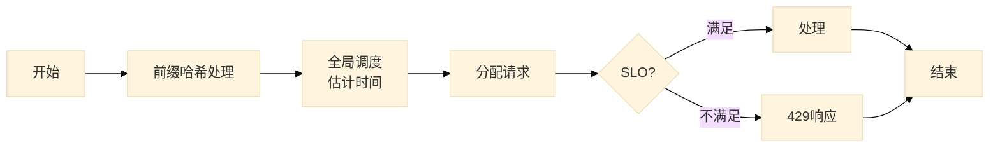

[原文链接](https://arxiv.org/html/2407.00079v3)
## 概述
Mooncake 的核心创新点在于它对KVCache的复用机制，和其他工程上实现大规模复用的技巧

- 1.1 前缀哈希匹配
- 1.2 动态缓存管理
- 1.3 分布式缓存架构
- 2.1 异步传输与重叠执行
- 2.2 预测与提前拒绝策略
- 2.3 启发式自动热点迁移
- 3.1 解耦架构设计
- 3.2 全局调度器Conductor
- 3.3 实验与性能评估

---

# KVCache 缓存机制



### 前缀哈希
- **前缀哈希**：每个块的哈希值不仅包含当前块的信息，还包含其所有前缀块的信息。这样做的目的是为了在缓存查找时能够更精确地匹配前缀。

#### 示例
假设输入文本为 "Hello, how are you?"，分块和前缀哈希的过程如下：

```plaintext
输入文本: "Hello, how are you?"
分块结果: ["Hello,", " how", " are", " you?"]
前缀哈希值: 
[hash("Hello,"), 
hash(hash("Hello,") + " how"), 
hash(hash(hash("Hello,") + " how") + " are"), hash(hash(hash(hash("Hello,") + " how") + " are") + " you?")]
```

---
### 变量表

| 变量名                | 类型       | 描述                                                                 |
|-----------------------|------------|--------------------------------------------------------------------------|
| `P`                   | 列表       | 填充实例池，包含所有可用的填充实例。                                     |
| `D`                   | 列表       | 解码实例池，包含所有可用的解码实例。                                     |
| `R`                   | 对象       | 当前处理的请求，包含输入令牌等信息。                                     |
| `B`                   | 整数       | 缓存块大小，用于计算前缀哈希键。                                         |
| `TTFT`                | 浮点数     | 时间到第一个令牌（Time To First Token），初始值为无穷大。                |
| `p`                   | 对象       | 选定的填充实例，初始值为空。                                             |
| `block_keys`          | 列表       | 请求的前缀哈希键列表。                                                   |
| `best_prefix_len`     | 整数       | 最佳前缀匹配长度。                                                       |
| `best_matched_instance` | 对象     | 具有最佳前缀匹配长度的填充实例。                                         |
| `instance`            | 对象       | 当前遍历的填充实例。                                                     |
| `prefix_len`          | 整数       | 当前填充实例的前缀匹配长度。                                             |
| `T_queue`             | 浮点数     | 当前填充实例的队列时间。                                                 |
| `kvcache_balancing_threshold` | 浮点数 | KVCache平衡阈值，用于判断是否需要进行缓存平衡。                         |
| `transfer_len`        | 整数       | 需要传输的KVCache长度。                                                  |
| `T_transfer`          | 浮点数     | KVCache传输时间。                                                        |
| `T_prefill`           | 浮点数     | 填充执行时间。                                                           |
| `d`                   | 对象       | 选定的解码实例。                                                         |
| `TBT`                 | 浮点数     | 令牌间时间（Time Between Tokens）。                                      |
| `TTFT_SLO`            | 浮点数     | TTFT的服务水平目标（Service Level Objective）。                          |
| `TBT_SLO`             | 浮点数     | TBT的服务水平目标。                                                      |

---
## 伪代码


**算法** KVCache-centric Scheduling Algorithm

1. **输入**：
   - `P`：填充实例池
   - `D`：解码实例池
   - `R`：请求
   - `B`：缓存块大小

2. **初始化**：
   - `TTFT` ← `inf`  # 初始化TTFT为无穷大
   - `p` ← `∅`  # 初始化填充实例为空

3. **计算前缀哈希键**：
   - `block_keys` ← `PrefixHash(R.prompt_tokens, B)`  # 计算请求的前缀哈希键

4. **查找最佳前缀匹配**：
   - `best_prefix_len, best_matched_instance` ← `FindBestPrefixMatch(P, block_keys)`  # 查找具有最长前缀匹配长度的填充实例

5. **遍历填充实例池**：
   - **for** `instance` ∈ `P` **do**  # 遍历每个填充实例
     - `prefix_len` ← `instance.prefix_len`  # 获取当前实例的前缀匹配长度
     - `T_queue` ← `EstimatePrefillQueueTime(instance)`  # 估计当前实例的队列时间

     - **if** `best_prefix_len > prefix_len * kvcache_balancing_threshold` **then**  # 如果最佳前缀匹配长度大于当前实例的前缀匹配长度乘以阈值
       - `transfer_len` ← `best_prefix_len - prefix_len`  # 计算需要传输的KVCache长度
       - `T_transfer` ← `EstimateKVCacheTransferTime(instance, best_matched_instance, transfer_len)`  # 估计KVCache传输时间
       - `T_prefill` ← `EstimatePrefillExecutionTime(len(R.prompt_tokens), best_prefix_len)`  # 估计填充执行时间

       - **if** `TTFT > T_transfer + T_queue + T_prefill` **then**  # 如果当前TTFT大于传输时间、队列时间和填充执行时间之和
         - `TTFT` ← `T_transfer + T_queue + T_prefill`  # 更新TTFT
         - `p` ← `instance`  # 更新选定的填充实例
       - **end if**
     - **else**  # 否则，仅考虑缓存感知调度
       - `T_prefill` ← `EstimatePrefillExecutionTime(len(R.prompt_tokens), prefix_len)`  # 估计填充执行时间

       - **if** `TTFT > T_queue + T_prefill` **then**  # 如果当前TTFT大于队列时间和填充执行时间之和
         - `TTFT` ← `T_queue + T_prefill`  # 更新TTFT
         - `p` ← `instance`  # 更新选定的填充实例
       - **end if**
     - **end if**
   - **end for**

6. **选择解码实例**：
   - `d, TBT` ← `SelectDecodingInstance(D)`  # 选择一个解码实例并估计其TBT

7. **检查SLO**：
   - **if** `TTFT > TTFT_SLO` **or** `TBT > TBT_SLO` **then**  # 如果TTFT或TBT超过SLO
     - **reject** `R`  # 拒绝请求
     - **return**  # 返回
   - **end if**

8. **执行KVCache热点迁移**：
   - **if** `best_prefix_len > p.prefix_len * kvcache_balancing_threshold` **then**  # 如果最佳前缀匹配长度大于选定实例的前缀匹配长度乘以阈值
     - `TransferKVCache(best_matched_instance, p)`  # 执行KVCache热点迁移
   - **end if**

9. **返回结果**：
   - **return** `(p, d)`  # 返回选定的填充实例和解码实例
